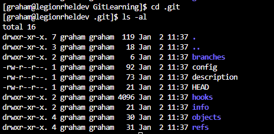

# Initialise Repository and set default branch to main

1. On Linux Box - /home/graham/Documents/Development/MSFTLearn/GitLearning
- [MSFT Learn](https://learn.microsoft.com/en-gb/training/modules/intro-to-git/)

```
git init -b main
```

2. This creates a .git folder 

